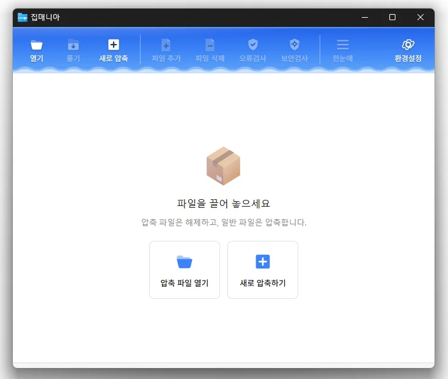

# 집매니아

**50여 가지 압축 파일을 열고 7Z · ZIP · TAR 로 압축하는, 빠르고 가벼운 Windows 용 무료 압축 프로그램.**

[English](README.md) · 한국어 · [简体中文](README.zh-CN.md) · [日本語](README.ja.md) · [Español](README.es.md) · [Português (Brasil)](README.pt-BR.md) · [Français](README.fr.md)


[](https://down.kilho.net/zipmania?lang=ko)



## 개요

집매니아는 압축 파일을 여닫는 일에 집중한 압축 프로그램입니다. ZIP·RAR·7Z·EGG·ALZ·ISO 를 비롯한 50여 가지 형식을 열고, 압축은 **7Z · ZIP · TAR** 세 가지로 만듭니다.

압축 파일을 열면 왼쪽에 폴더 구조, 오른쪽에 파일 목록이 나옵니다. 필요한 파일만 골라 풀거나 탐색기로 끌어다 놓을 수 있고, 이미지는 압축을 풀지 않고 바로 미리봅니다. 파일을 더블클릭하면 연결된 프로그램으로 바로 열리고, 압축 파일 안에 있는 또 다른 압축 파일은 새 창으로 열립니다.

탐색기 우클릭 메뉴에서 "여기에 풀기", "*이름*.zip 으로 압축하기" 같은 한 번 클릭 동작을 쓸 수 있고, 자동 백업이나 토탈 커맨더 같은 외부 프로그램에서 쓸 수 있는 명령줄 도구(`zm.exe`)도 들어 있습니다. 광고나 번들 설치는 없습니다.

## 주요 기능

- **50여 가지 형식 열기** — ZIP, ZIPX, JAR, RAR, 7Z, EGG, ALZ, TAR, GZ, BZ2, XZ, ZST, ISO, IMG, WIM, DMG, MSI, RPM, DEB, CAB, CBZ, CBR 등.
- **7Z · ZIP · TAR 로 압축** — 압축 정도 5단계, 암호, 7Z 파일명 암호화, 분할 압축.
- **빠른 ZIP 처리** — ZIP 전용 엔진이 압축·해제를 처리합니다.
- **필요한 파일만** — 목록에서 고른 파일만 풀거나, 탐색기로 끌어다 놓거나, 더블클릭으로 바로 엽니다.
- **압축 안의 압축 파일** — 더블클릭하면 새 창에서 열립니다.
- **이미지 미리보기** — JPG, PNG, GIF, WebP, SVG 등을 압축을 풀지 않고 왼쪽 아래에서 확인합니다.
- **압축 파일 편집** — 7Z·ZIP·TAR 에 파일을 추가하거나 삭제합니다.
- **오류검사 · 보안검사** — 손상 여부(CRC)를 표로 보여 주고, Windows 백신(AMSI)으로 내부 파일을 검사합니다.
- **압축 후 정리** — 압축이 끝나면 무결성을 검사하고, 통과했을 때만 원본을 삭제합니다.
- **탐색기 우클릭 메뉴** — 여기에 풀기, *이름* 에 풀기, *이름*.zip 으로 압축하기, 각각 압축하기, 각각 폴더에 풀기.
- **명령줄 도구** — `zm.exe`(콘솔) 와 `ZipMania.exe`(진행 창) 로 압축·해제·목록·검사. 7-Zip·Bandizip 식 옵션 표기를 둘 다 받습니다.
- **다크·라이트 테마, 9개 언어** — 기본은 Windows 설정을 따르고 직접 고를 수도 있습니다.

## 다운로드 / 설치

| 구분 | 링크 |
|---|---|
| 설치 파일 | [다운로드](https://down.kilho.net/zipmania?lang=ko) |
| 무설치 (ZIP) | [다운로드](https://down.kilho.net/zipmania?lang=ko&nosetup) |

집매니아는 포터블로 쓸 수 있습니다. ZIP 을 원하는 곳에 풀고 `ZipMania.exe` 를 실행하세요. 설정은 실행 파일 옆 `settings.toml` 에 저장되므로 USB 메모리에 담아 다녀도 설정이 그대로 따라갑니다.

## 사용법

### 기본 흐름

**압축 풀기**

1. 압축 파일을 더블클릭하거나, 집매니아를 실행해 **[열기]** 로 고르거나, 창 안에 끌어다 놓습니다.
2. 왼쪽 폴더 트리와 오른쪽 파일 목록에서 내용을 확인합니다. 파일을 고르고 **[풀기]** 를 누릅니다.
3. **압축 풀기** 창에서 대상 폴더를 고릅니다. 왼쪽 바로가기(바탕 화면·문서·다운로드 등)나 폴더 트리를 쓰고, 빈 곳을 우클릭해 새 폴더를 만들 수도 있습니다.
4. **압축 풀 파일**을 **전체 파일** / **선택된 파일** 중에서 고르고 **[확인]** 을 누릅니다. 진행률·속도·남은 시간이 표시되고, 끝나면 **[폴더 열기]** 로 결과를 바로 볼 수 있습니다.

**압축하기**

1. 툴바의 **[새로 압축]** 을 누르거나, 파일·폴더를 집매니아 창에 끌어다 놓습니다.
2. **새 압축** 창에 파일 목록이 채워집니다. **[파일 추가]** / **[폴더 추가]** 로 더 넣거나 창에 끌어다 놓습니다.
3. **파일 이름**(저장 위치), **압축 형식**(7Z · ZIP · TAR), 필요하면 **암호 설정**, **분할 압축**, **압축 후** 동작, **압축 방법**을 정합니다.
4. **[압축 시작]** 을 누릅니다. 끝나면 **[폴더 열기]** 또는 **[닫기]**.

탐색기에서 바로 하려면 우클릭 메뉴를 쓰세요 — 아래 "이럴 때 이렇게" 에 있습니다.

### 화면 구성

| 툴바 버튼 | 하는 일 |
|---|---|
| **열기** | 압축 파일 열기 |
| **풀기** | 열린 압축 파일을 풀기 (파일을 골라 두었으면 그 파일만 풀 수 있음) |
| **새로 압축** | 파일·폴더를 골라 새 압축 파일 만들기 |
| **파일 추가** / **파일 삭제** | 열린 압축 파일에 파일 넣기·빼기 (7Z · ZIP · TAR 만) |
| **오류검사** | 압축 파일이 손상되지 않았는지 검사 (CRC) |
| **보안검사** | Windows 백신으로 내부 파일 검사 (10 MB 미만 파일) |
| **한눈에** | 폴더 구조 없이 전체 파일을 경로와 함께 한 목록으로 |
| **환경설정** | 테마·언어·풀기 기본값·파일 연결·탐색기 메뉴 |

- **왼쪽 위 폴더 트리** — 클릭하면 그 폴더의 파일이 오른쪽에 나옵니다.
- **왼쪽 아래 미리보기** — 이미지 파일 하나를 고르면 나타납니다.
- **파일 목록** — 이름 · 크기 · 압축 크기 · 종류 · 수정일. 이름·크기·수정일 머리글을 클릭하면 정렬, 경계를 끌면 열 너비 조절.
- **상태줄** — 항목 수, 선택한 파일 수와 크기, 압축 크기와 압축률.
- 가운데 경계를 끌어 트리와 목록의 폭을 바꿀 수 있고, 창 크기와 최대화 상태는 다음 실행 때 그대로 복원됩니다.

### 이럴 때 이렇게

**탐색기에서 바로 풀기**
압축 파일을 우클릭하면 집매니아 메뉴가 나옵니다.
- **여기에 풀기** — 묻지 않고 압축 파일이 있는 폴더에 곧바로 풉니다. 진행 창에서 **창닫기**를 켜 두면 끝나자마자 닫힙니다.
- **"이름" 에 풀기** — 압축 파일 이름과 같은 새 폴더를 만들어 그 안에 풉니다. 파일이 많은 압축 파일에 알맞습니다.
- **집매니아로 압축 풀기…** — 대상 폴더와 옵션을 고르는 창이 열립니다.
- **집매니아로 열기** — 내용을 먼저 살펴봅니다.

압축 파일을 **여러 개 골라** 우클릭하면 **여기에 풀기** 는 차례로 풀고, **각각 파일명 폴더에 풀기** 는 압축 파일마다 자기 이름 폴더에 풉니다.

**탐색기에서 바로 압축하기**
파일이나 폴더를 우클릭합니다.
- **"이름.zip"(으)로 압축하기** — 묻지 않고 곧바로 같은 자리에 ZIP 을 만듭니다. 폴더 하나면 폴더 이름, 여러 개면 현재 폴더 이름이 파일 이름이 됩니다. 같은 이름이 있으면 `이름 (2).zip` 처럼 번호를 붙입니다.
- **집매니아로 압축하기** — 형식·암호·분할 등을 고르는 창이 열립니다.
- **각각 압축하기** — 고른 항목마다 자기 이름의 ZIP 을 하나씩 만듭니다. 폴더 여러 개를 따로따로 보관할 때 씁니다.

**압축 파일에서 필요한 파일 몇 개만 꺼내기**
세 가지 방법이 있습니다.
- 파일을 고르고(Ctrl·Shift 로 여러 개) **[풀기]** → **압축 풀 파일**에서 **선택된 파일**.
- 고른 파일을 우클릭 → **선택한 파일 압축 풀기**.
- 고른 파일을 **탐색기나 바탕 화면으로 끌어다 놓기** — 그 자리에 바로 풀립니다.

**압축 안의 파일을 풀지 않고 바로 열기**
파일을 더블클릭하거나 Enter 를 누르면 연결된 프로그램으로 열립니다(문서는 편집기, 동영상은 플레이어). 우클릭 → **파일 실행** 도 같습니다. 임시로 푼 파일은 집매니아를 닫을 때 정리됩니다.

**압축 안에 또 압축 파일이 있을 때**
그 파일을 더블클릭하면 **새 창**에 열립니다. 창을 여러 개 띄워 두고 오갈 수 있습니다.

**압축 안 사진을 빠르게 훑어보기**
이미지 파일(JPG · PNG · GIF · BMP · WebP · ICO · SVG · TIFF · AVIF)을 하나 고르면 왼쪽 아래에 미리보기가 나옵니다. 방향키로 내려가며 차례로 볼 수 있습니다. 32 MB 가 넘는 이미지는 미리보기 대신 안내가 나옵니다.

**폴더가 깊어서 파일 찾기가 번거로울 때**
툴바 **[한눈에]** 를 켜면 폴더 구조를 없애고 전체 파일을 경로와 함께 한 목록으로 보여 줍니다. 이름·크기·수정일로 정렬해 큰 파일이나 최근 파일을 바로 찾을 수 있습니다. 다시 누르면 폴더 보기로 돌아갑니다.

**암호가 걸린 압축 파일**
열 때 암호 창이 나옵니다. 틀리면 다시 묻고, 맞으면 그 압축 파일에 대해 기억해 두어 미리보기·실행·풀기에 다시 묻지 않습니다. 풀기 도중 암호가 필요한 파일이 나오면 그때 묻고, 입력하지 않으면 그 파일만 건너뛰고 나머지를 계속합니다.

**암호를 걸어 압축하기**
**새 압축** 창에서 **[암호 설정]** 을 누르고 입력합니다.
- **7Z** 를 고르면 **파일명도 암호화**를 켤 수 있습니다. 암호 없이는 안에 어떤 파일이 있는지도 볼 수 없습니다.
- **ZIP** 은 영문·숫자 암호만 됩니다. 한글 암호는 경고가 나오고 시작되지 않습니다 — 7Z 로 바꾸거나 영문 암호를 쓰세요.
- **TAR** 는 암호를 지원하지 않습니다.

**큰 파일을 메일이나 메신저로 보내야 할 때**
**분할 압축**에서 10 MB · 25 MB · 100 MB · 700 MB · 1 GB · 4 GB 를 고르거나 **직접 입력…** 에 `700M`, `4GB` 처럼 씁니다. `이름.7z.001`, `.002`… 로 나뉘어 저장됩니다(7Z · ZIP). 받는 쪽은 조각을 한 폴더에 모아 **`.001` 파일만** 열거나 풀면 됩니다.

**압축한 뒤 원본을 지워 공간 확보하기**
**압축 후**에서 **무결성 검사**와 **원본 삭제**를 켭니다. 모든 파일이 빠짐없이 담기고 검사까지 통과했을 때만 원본을 지우므로, 압축이 잘못된 채로 원본이 사라지는 일은 없습니다.

**폴더 여러 개를 각각 따로 압축하기**
**새 압축** 창에 폴더들을 넣고 **각각 파일명/폴더명으로 압축**을 켭니다. 폴더마다 자기 이름의 압축 파일이 자기 자리에 만들어집니다. 탐색기 우클릭 → **각각 압축하기** 와 같은 일이며, 창에서는 형식과 암호까지 고를 수 있습니다.

**빠르게 / 작게 압축하기**
**압축 방법**은 **저장(압축 안 함)** · **빠름** · **보통** · **높음** · **최고** 다섯 단계입니다. 이미 압축된 사진·동영상을 묶기만 할 때는 **저장**이 가장 빠르고, 문서·소스 코드처럼 잘 줄어드는 파일은 **높음**이나 **최고**가 유리합니다. 가장 작게 만들려면 형식은 **7Z** 를 쓰세요(기본값).

**이미 만든 압축 파일에 파일 넣고 빼기**
7Z · ZIP · TAR 압축 파일을 연 상태에서:
- **[파일 추가]** 를 누르거나 파일을 창에 끌어다 놓습니다 — "파일 N개를 … 에 추가할까요?" 에 예.
- 파일을 고르고 **[파일 삭제]** 또는 우클릭 → **파일 삭제**.
다른 형식(RAR, EGG 등)은 편집이 안 되므로 버튼이 비활성화됩니다.

**받은 압축 파일이 멀쩡한지 확인하기**
**[오류검사]** 를 누르면 파일마다 예상 CRC 와 실제 CRC 를 비교해 표로 보여 줍니다. 전송 중 깨졌거나 일부만 받은 파일을 풀기 전에 걸러낼 수 있습니다.

**받은 압축 파일이 안전한지 확인하기**
**[보안검사]** 는 압축을 풀지 않고 내부 파일을 Windows 백신(AMSI)에 넘겨 검사합니다. 10 MB 이상 파일은 건너뛰며, 실시간 보호가 켜진 백신이 있어야 합니다. 결과는 파일별 정상 · 위협 · 건너뜀으로 표시됩니다.

**풀 때 같은 이름의 파일이 이미 있을 때**
파일마다 **덮어쓰기** · **건너뛰기** · **이름 변경** 을 묻습니다. **모든 파일에 적용**을 켜면 남은 파일에 같은 선택이 적용됩니다.

**풀었더니 파일이 폴더에 흩어졌을 때**
기본으로 **대상 폴더 하위에 '압축 파일명' 폴더 생성**이 켜져 있어 압축 파일 이름의 폴더 안에 풀립니다. 폴더 없이 바로 풀고 싶으면 **압축 풀기** 창이나 **환경설정 → 압축 풀기**에서 끄거나, 탐색기의 **여기에 풀기**를 쓰세요.

**풀고 나면 압축 파일은 지우고 폴더는 열리게**
**환경설정 → 압축 풀기**에서 **압축 풀기 성공 후 압축 파일 삭제**, **대상 폴더 열기**, **풀기 창 닫기**를 켭니다. 압축 풀기 창에서도 그때그때 바꿀 수 있습니다. 압축 파일 삭제는 풀기가 성공했을 때만 실행됩니다.

**압축 파일을 더블클릭하면 집매니아로 열리게**
**환경설정 → 파일 연결**에서 확장자를 체크합니다. 다른 프로그램이 이미 그 확장자를 쓰고 있으면 **[적용안됨]** 표시가 나오는데, 클릭하면 Windows 의 기본 앱 선택 창이 열려 집매니아로 바꿀 수 있습니다. 집매니아로 압축 파일을 열었을 때 화면 위에 "기본 앱을 집매니아로 변경하시겠습니까?" 안내가 나오면 거기서 바로 바꿔도 됩니다.

**우클릭 메뉴에 집매니아가 보이지 않을 때**
**환경설정 → 탐색기 메뉴**에서 **탐색기 우클릭 메뉴에 집매니아 압축·풀기 추가**를 켭니다. Windows 11 에서는 기본 메뉴에 나타나며, 보이지 않으면 **더 많은 옵션 표시**(Shift+F10) 아래를 확인하세요.

**압축 파일이 있는 폴더 열기 / 압축 파일 삭제**
목록의 빈 곳을 우클릭하면 **압축 파일이 있는 폴더 열기**와 **압축 파일 삭제하기**가 있습니다. 내용을 확인한 뒤 필요 없는 압축 파일을 그 자리에서 지울 수 있습니다.

**목록을 키보드로 다루기**
방향키 · Page Up/Down · Home/End 로 이동, Shift 로 범위 선택, Ctrl 클릭으로 하나씩 추가, **Ctrl+A** 전체 선택, Enter 로 폴더 들어가기·파일 열기, Esc 로 암호·검사 창 닫기.

**다크 모드와 언어**
기본은 Windows 설정을 따릅니다. **환경설정 → 일반 설정**에서 테마(시스템 · 라이트 · 다크)와 언어(한국어 · English · 日本語 · 中文 · Русский · Italiano · Français · Español · العربية)를 직접 고를 수 있고, 바꾸면 즉시 적용됩니다. 탐색기 메뉴 문구도 같은 언어로 나옵니다.

**자동 백업 스크립트나 토탈 커맨더에서 쓰기**
실행 파일 두 개를 씁니다.
- **`zm.exe`** — 콘솔에 출력합니다. cmd · PowerShell · 배치 파일에서 끝날 때까지 기다리고 종료 코드(0 성공 / 1 경고 / 2 오류)를 돌려줍니다.
- **`ZipMania.exe`** — 같은 명령을 **진행 창**으로 보여 줍니다. 토탈 커맨더처럼 콘솔이 없는 곳에 맞습니다.

```
<exe> a|c [옵션] <압축파일> <입력...>    압축 (a 는 기존 압축 파일에 추가)
<exe> x|e [옵션] <압축파일> [항목...]    풀기 (x 폴더 구조 유지, e 파일만)
<exe> bx  [옵션] <압축파일...>           압축 파일마다 자기 이름 폴더에 풀기
<exe> l   [옵션] <압축파일>              목록
<exe> t   [옵션] <압축파일>              무결성 검사
```

| 옵션 | 뜻 |
|---|---|
| `-l:0..9` / `-mx9` | 압축 레벨 |
| `-fmt:zip\|7z\|tar` / `-t7z` | 형식 (생략하면 확장자로) |
| `-v:700M` / `-v700m` | 분할 크기 |
| `-p:암호` / `-p암호` | 암호 |
| `-o:폴더` / `-o폴더` | 풀 폴더 |
| `-target:auto\|name\|none` | 압축 파일 이름의 하위 폴더에 풀기 (`auto` = 최상위 항목이 둘 이상일 때만) |
| `-aoa` `-y` / `-aos` / `-aou` | 같은 이름이 있으면 덮어쓰기 / 건너뛰기 / `이름 (2)` 로 |
| `-testdst` | 압축 후 무결성 검사 |
| `-delsrc` / `-sdel` | 검사를 통과하면 원본 삭제 |
| `-date` | 파일 이름의 `%Y %y %m %d %H %M %S` 를 현재 시각으로 |

예:

```
zm c -l:9 -fmt:7z -testdst -delsrc -date "backup_%y%m%d_%H%M.7z" "D:\Work"   날짜 이름 7Z 로 백업, 검사 후 원본 삭제
zm a -mx9 -psecret backup.7z D:\Work                                       7-Zip 표기, 기존 압축 파일에 추가
zm x -o:D:\Out -target:auto backup.7z                                      압축 파일 이름 폴더로 풀기
zm bx a.zip b.7z                                                            각각 a\, b\ 폴더에 풀기
zm l backup.7z.001                                                          분할 첫 조각 목록
```

`zm` 만 입력하면 도움말이 나옵니다. 배치 파일 안에서는 `%` 를 `%%` 로 씁니다. 토탈 커맨더 사용자 명령은 명령 `zm.exe`, 매개변수 `c -l:9 -fmt:7z -aou -testdst -delsrc -date "%T%S %y%m%d_%H%M".7z "%P%S"` 처럼 두면 선택한 항목을 반대쪽 창 폴더에 날짜 이름 7Z 로 압축합니다.

## 설정

**환경설정**(툴바 맨 오른쪽)에서 바꾸며, 바꾸는 즉시 저장됩니다. **[초기화]** 로 전부 기본값으로 되돌릴 수 있습니다.

| 분류 | 항목 | 기본값 |
|---|---|---|
| 일반 설정 | 테마 (시스템 · 라이트 · 다크) | 시스템 |
| 일반 설정 | 언어 (시스템 + 9개 언어) | 시스템 |
| 압축 풀기 | 대상 폴더 하위에 '압축 파일명' 폴더 생성 | 켜짐 |
| 압축 풀기 | 압축 풀기 성공 후 압축 파일 삭제 | 꺼짐 |
| 압축 풀기 | 압축 풀기 성공 후 대상 폴더 열기 | 꺼짐 |
| 압축 풀기 | 압축 풀기 성공 후 풀기 창 닫기 | 꺼짐 |
| 파일 연결 | 더블클릭으로 집매니아에서 열 확장자 (zip · 7z · rar · tar · gz · tgz · bz2 · xz · egg · alz · cbz) | 설치 시 연결 |
| 탐색기 메뉴 | 탐색기 우클릭 메뉴에 집매니아 압축·풀기 추가 | 설치 시 켜짐 |

새 압축 창과 압축 풀기 창의 **창닫기** · **폴더 열기** 체크는 마지막 선택이 기억됩니다.

## 요구 사항

- Windows 10 또는 Windows 11, **64비트**
- 별도 런타임이나 구성 요소 설치는 필요 없습니다.
- 인터넷은 새 버전 안내를 확인할 때만 사용합니다. 압축·해제는 오프라인에서도 됩니다.

## 업데이트

집매니아는 자동으로 업데이트하지 **않습니다**. 실행할 때 새 버전이 있는지 확인해 안내만 하며, 새 버전은 내부 검증 후 수동으로 배포되고 [집매니아 페이지](https://kilho.net/zipmania)에 공지됩니다. [업데이트 정책 안내](https://kilho.net/archives/notice/2940)를 참고하세요.

**버전 이력**

| 버전 | 날짜 | 내용 |
|---|---|---|
| 0.9.9 | 2026-09-21 | 자체 화면 엔진으로 새로 만듦 — 실행 속도와 화면 반응 약 9배 개선, 별도 구성 요소 없이 실행, 일부 환경의 실행 문제와 화면 지연 개선 |
| 0.9.8 | 2026-09-18 | 명령줄 강화 — 7-Zip/Bandizip 호환 옵션, `zm.exe` 추가, 해제·목록·검사 명령, 압축 후 검사와 원본 삭제, 기존 압축 파일에 추가, 각각 폴더에 풀기, 덮어쓰기·건너뛰기·이름 변경 선택, 진행률·속도·남은 시간 표시 |
| 0.9.6 | 2026-09-16 | 분할 압축, 분할 파일은 첫 조각만 열어 풀기, 외부 프로그램에서 창 없이 압축, 취소·실패 시 불완전한 파일이 남지 않도록 개선 |
| 0.9.5 | 2026-09-10 | 탐색기 메뉴 안정성, 진행률·실패 개수·누락 파일 표시, 완료 후 결과 폴더 열기, 폴더 찾기 개선 |

## 소스 빌드

소스는 [github.com/newkilho/ZipMania](https://github.com/newkilho/ZipMania) 에 공개되어 있습니다(Rust 1.88 이상). 압축·해제 엔진인 `crates/zipmania-archive` 는 저장소만으로 빌드와 테스트가 됩니다.

```
cargo test -p zipmania-archive
```

앱 화면(`app/`)은 저장소 밖의 자체 화면 엔진과 공용 라이브러리에 의존하므로 저장소만으로는 실행 파일이 만들어지지 않습니다.

## 기여

버그 제보와 제안은 GitHub 이슈나 [포럼](https://groups.google.com/g/kilhonet)으로 보내 주세요.

## 라이선스

집매니아 프로그램은 **프리웨어**입니다. 회사, 집, 관공서, 학교 어디서나 제약 없이 무료로 쓸 수 있고, 수정하지 않은 형태로 자유롭게 재배포할 수 있습니다.

소스 코드는 **Apache License 2.0** 을 따르며, `crates/` 의 재사용 크레이트는 MIT 또는 Apache-2.0 중 선택할 수 있습니다. "ZipMania", "집매니아" 이름과 로고·아이콘은 Kilho.net 의 상표로 라이선스에 포함되지 않습니다 — 고쳐서 배포할 때는 다른 이름과 아이콘을 쓰세요. 7-Zip 의 `7z.dll`(LGPL) 을 비롯한 오픈소스 구성 요소는 저장소의 `THIRD-PARTY-NOTICES.txt` 에 있습니다.

## 링크

- 웹사이트: <https://kilho.net/zipmania>
- 소스: <https://github.com/newkilho/ZipMania>
- 포럼: <https://groups.google.com/g/kilhonet>
- X (Twitter): <https://www.twitter.com/kilhonet>

© KILHO.NET
