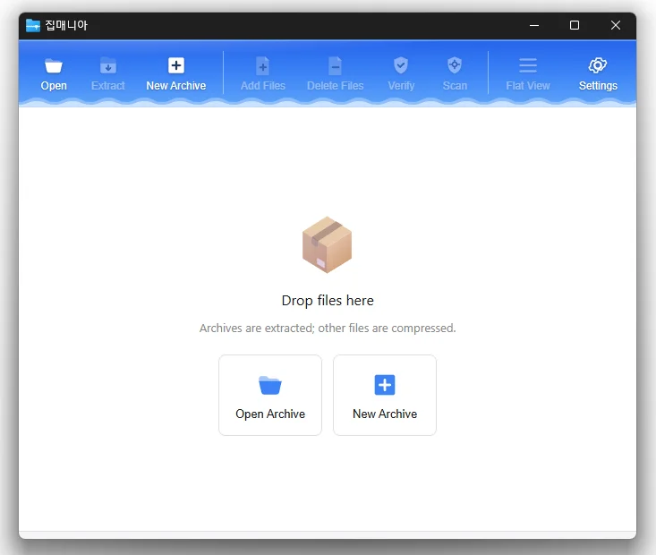

# ZipMania

**可打开 50 多种压缩格式、压缩为 7Z · ZIP · TAR 的快速轻巧的 Windows 免费压缩软件。**

[English](README.md) · [한국어](README.ko.md) · 简体中文 · [日本語](README.ja.md) · [Español](README.es.md) · [Português (Brasil)](README.pt-BR.md) · [Français](README.fr.md)

> 本文档为翻译版本。如内容有出入，以[韩文版](README.ko.md)为准。


[](https://down.kilho.net/zipmania?lang=zh)



## 概述

ZipMania 是一款专注于打开和创建压缩包的压缩软件。它可以打开 ZIP、RAR、7Z、EGG、ALZ、ISO 等 50 多种格式，并以 **7Z · ZIP · TAR** 三种格式创建压缩包。

打开压缩包后，左侧显示文件夹树，右侧显示文件列表。你可以只挑选需要的文件解压，或直接拖到资源管理器中；图片无需解压即可预览。双击文件会用关联的程序打开，压缩包里的压缩包则在新窗口中打开。

在资源管理器右键菜单中可以使用"解压到当前文件夹"、"压缩为 *名称*.zip"等一键操作，还附带可用于自动备份或 Total Commander 等外部程序的命令行工具（`zm.exe`）。没有广告，也没有捆绑安装。

## 主要功能

- **打开 50 多种格式** — ZIP、ZIPX、JAR、RAR、7Z、EGG、ALZ、TAR、GZ、BZ2、XZ、ZST、ISO、IMG、WIM、DMG、MSI、RPM、DEB、CAB、CBZ、CBR 等。
- **压缩为 7Z · ZIP · TAR** — 5 级压缩强度、密码、7Z 文件名加密、分卷压缩。
- **快速 ZIP 处理** — 由 ZIP 专用引擎负责压缩和解压。
- **只取所需** — 只解压列表中选中的文件、拖到资源管理器，或双击直接打开。
- **压缩包中的压缩包** — 双击即在新窗口中打开。
- **图片预览** — JPG、PNG、GIF、WebP、SVG 等无需解压即可在左下方查看。
- **编辑压缩包** — 向 7Z · ZIP · TAR 添加或删除文件。
- **错误检查 · 安全扫描** — 以表格显示是否损坏（CRC），并通过 Windows 杀毒软件（AMSI）扫描内部文件。
- **压缩后清理** — 压缩完成后进行完整性检查，仅在通过时删除源文件。
- **资源管理器右键菜单** — 解压到当前文件夹、解压到 *名称*、压缩为 *名称*.zip、分别压缩、分别解压到各自文件夹。
- **命令行工具** — 用 `zm.exe`（控制台）和 `ZipMania.exe`（进度窗口）进行压缩、解压、列表和检查。同时接受 7-Zip 和 Bandizip 两种选项写法。
- **深色 / 浅色主题，9 种语言** — 默认跟随 Windows 设置，也可自行选择。

## 下载 / 安装

| 类型 | 链接 |
|---|---|
| 安装包 | [下载](https://down.kilho.net/zipmania?lang=zh) |
| 便携版 (ZIP) | [下载](https://down.kilho.net/zipmania?lang=zh&nosetup) |

ZipMania 可作为便携软件使用：把 ZIP 解压到任意位置，运行 `ZipMania.exe` 即可。设置保存在可执行文件旁的 `settings.toml` 中，放进 U 盘随身携带时设置也会一起带走。

## 使用方法

### 快速上手

**解压**

1. 双击压缩包，或启动 ZipMania 后用 **[打开]** 选择，或把压缩包拖进窗口。
2. 在左侧文件夹树和右侧文件列表中查看内容。选中文件后点击 **[解压]**。
3. 在**解压**窗口中选择目标文件夹。可使用左侧快捷方式（桌面、文档、下载等）或文件夹树，也可以在空白处右键新建文件夹。
4. 在**要解压的文件**中选择**全部文件** / **选中的文件**，然后点击 **[确定]**。窗口会显示进度、速度和剩余时间，完成后点击 **[打开文件夹]** 即可查看结果。

**压缩**

1. 点击工具栏的 **[新建压缩]**，或把文件、文件夹拖进 ZipMania 窗口。
2. **新建压缩**窗口会列出这些文件。可用 **[添加文件]** / **[添加文件夹]** 继续添加，或直接拖进窗口。
3. 设置**文件名**（保存位置）、**格式**（7Z · ZIP · TAR），需要时再设置**设置密码**、**分卷**、**压缩后**操作和**压缩方式**。
4. 点击 **[开始]**。完成后点击 **[打开文件夹]** 或 **[关闭]**。

想直接在资源管理器中操作，请使用右键菜单 — 见下文"遇到这些情况时"。

### 窗口布局

| 工具栏按钮 | 作用 |
|---|---|
| **打开** | 打开压缩包 |
| **解压** | 解压已打开的压缩包（若已选中文件，则可只解压这些文件） |
| **新建压缩** | 选择文件、文件夹创建新压缩包 |
| **添加文件** / **删除文件** | 向已打开的压缩包添加或移除文件（仅 7Z · ZIP · TAR） |
| **校验** | 检查压缩包是否损坏（CRC） |
| **扫描** | 用 Windows 杀毒软件扫描内部文件（小于 10 MB 的文件） |
| **平铺视图** | 忽略文件夹结构，将所有文件连同路径显示在一个列表中 |
| **设置** | 主题、语言、解压默认值、文件关联、资源管理器菜单 |

- **左上文件夹树** — 点击文件夹，其中的文件显示在右侧。
- **左下预览** — 选中单个图片文件时出现。
- **文件列表** — 名称 · 大小 · 压缩后大小 · 类型 · 修改时间。点击名称、大小、修改时间的表头可排序，拖动边界可调整列宽。
- **状态栏** — 项目数、选中文件的数量和大小、压缩后大小和压缩率。
- 拖动中间的分隔条可调整树和列表的宽度；窗口大小和最大化状态会在下次启动时恢复。

### 遇到这些情况时

**直接在资源管理器中解压**
右键点击压缩包即可看到 ZipMania 菜单。
- **解压到当前文件夹** — 不再询问，直接解压到压缩包所在文件夹。若在进度窗口中勾选**关闭窗口**，完成后会立即关闭。
- **解压到 "名称"** — 新建一个与压缩包同名的文件夹并解压到其中。适合文件很多的压缩包。
- **用 ZipMania 解压…** — 打开可选择目标文件夹和选项的窗口。
- **用 ZipMania 打开** — 先查看内容。

**选中多个压缩包**后右键，**解压到当前文件夹**会依次解压，**分别解压到各自文件夹**则把每个压缩包解压到与其同名的文件夹。

**直接在资源管理器中压缩**
右键点击文件或文件夹。
- **压缩为 "名称.zip"** — 不再询问，直接在原位置创建 ZIP。单个文件夹以文件夹名命名，多个项目则以当前文件夹名命名。若已有同名文件，会加上编号，如 `名称 (2).zip`。
- **用 ZipMania 压缩** — 打开可选择格式、密码、分卷等的窗口。
- **分别压缩** — 为每个选中项目各创建一个同名 ZIP。适合把多个文件夹分开保存。

**只从压缩包中取出几个文件**
有三种方法：
- 选中文件（Ctrl、Shift 可多选），点击 **[解压]** → 在**要解压的文件**中选择**选中的文件**。
- 右键选中的文件 → **解压选中的文件**。
- 把选中的文件**拖到资源管理器或桌面** — 会直接解压到那里。

**不解压直接打开压缩包中的文件**
双击文件或按 Enter，即用关联的程序打开（文档用编辑器，视频用播放器）。右键 → **运行文件**效果相同。临时解压的文件会在关闭 ZipMania 时清理。

**压缩包里还有压缩包**
双击该文件即在**新窗口**中打开。可同时打开多个窗口并来回切换。

**快速浏览压缩包中的照片**
选中一个图片文件（JPG · PNG · GIF · BMP · WebP · ICO · SVG · TIFF · AVIF），左下方就会显示预览。用方向键向下移动即可依次查看。超过 32 MB 的图片会显示提示而非预览。

**文件夹层级太深，不好找文件**
打开工具栏的 **[平铺视图]**，即可去掉文件夹结构，把所有文件连同路径列在一个列表中。按名称、大小、修改时间排序，就能马上找到大文件或最近的文件。再点一次即返回文件夹视图。

**带密码的压缩包**
打开时会弹出密码输入框。输错会再次询问，输对后会为该压缩包记住密码，预览、运行、解压时不再询问。若在解压过程中遇到需要密码的文件，会在那时询问；不输入则只跳过该文件，继续处理其余文件。

**加密码压缩**
在**新建压缩**窗口中点击 **[设置密码]** 并输入。
- 选择 **7Z** 时可以开启**同时加密文件名**。没有密码就连里面有哪些文件都看不到。
- **ZIP** 只支持字母和数字密码。使用非 ASCII 密码会显示警告且无法开始 — 请改用 7Z 或使用英文数字密码。
- **TAR** 不支持密码。

**需要通过邮件或聊天软件发送大文件**
在**分卷**中选择 10 MB · 25 MB · 100 MB · 700 MB · 1 GB · 4 GB，或选择**自定义…**并输入 `700M`、`4GB` 之类的值。压缩包会被分成 `名称.7z.001`、`.002`… 保存（7Z · ZIP）。接收方只需把各部分放在同一文件夹中，**只打开或解压 `.001` 文件**即可。

**压缩后删除源文件以腾出空间**
在**压缩后**中勾选**校验压缩包**和**删除源文件**。只有当所有文件都已完整存入并通过校验时才会删除源文件，因此不会出现压缩失败却丢了源文件的情况。

**把多个文件夹分别压缩**
把文件夹放进**新建压缩**窗口，勾选**将每个项目压缩为单独的压缩包**。每个文件夹都会在原位置生成一个同名压缩包。这与资源管理器右键的**分别压缩**相同，但在窗口中还可以选择格式和密码。

**压缩得更快 / 更小**
**压缩方式**分为**存储（不压缩）** · **快速** · **标准** · **较高** · **最高**五级。只是把已压缩的照片、视频打包时，**存储**最快；文档、源代码等容易压缩的文件用**较高**或**最高**更划算。想得到最小的结果，请使用 **7Z** 格式（默认值）。

**向已有的压缩包添加或删除文件**
打开 7Z · ZIP · TAR 压缩包后：
- 点击 **[添加文件]**，或把文件拖进窗口 — 在"是否将 N 个文件添加到 …？"中选择"是"。
- 选中文件后点击 **[删除文件]**，或右键 → **删除文件**。
其他格式（RAR、EGG 等）不支持编辑，相应按钮会被禁用。

**确认收到的压缩包是否完好**
点击 **[校验]**，会逐个文件比较预期 CRC 与实际 CRC 并以表格显示。传输中损坏或只收到一部分的文件可以在解压前被发现。

**确认收到的压缩包是否安全**
**[扫描]** 会在不解压的情况下把内部文件交给 Windows 杀毒软件（AMSI）检查。10 MB 及以上的文件会被跳过，并且需要开启了实时保护的杀毒软件。结果按文件显示为正常 · 威胁 · 已跳过。

**解压时已有同名文件**
会逐个文件询问**覆盖** · **跳过** · **重命名**。勾选**应用到其余所有文件**后，剩余文件都会采用相同选择。

**解压后文件散落在文件夹里**
默认开启**创建与压缩包同名的子文件夹**，文件会解压到以压缩包命名的文件夹中。若想直接解压而不建文件夹，可在**解压**窗口或**设置 → 解压**中关闭，或使用资源管理器的**解压到当前文件夹**。

**解压完成后删除压缩包并打开文件夹**
在**设置 → 解压**中勾选**解压成功后删除压缩包**、**打开目标文件夹**和**关闭解压窗口**。也可以在解压窗口中随时更改。只有解压成功时才会删除压缩包。

**让双击压缩包时用 ZipMania 打开**
在**设置 → 文件关联**中勾选扩展名。若其他程序已占用该扩展名，会显示 **[未应用]**，点击后会打开 Windows 的默认应用选择窗口，可改为 ZipMania。当 ZipMania 打开压缩包并在顶部提示"是否将 … 文件的默认应用改为 ZipMania？"时，也可以直接在那里更改。

**右键菜单中看不到 ZipMania**
在**设置 → 资源管理器菜单**中勾选**在资源管理器右键菜单中添加 ZipMania 压缩/解压**。在 Windows 11 中它会出现在默认菜单里；若没有看到，请到**显示更多选项**（Shift+F10）下查找。

**打开压缩包所在文件夹 / 删除压缩包**
右键点击列表空白处，可看到**打开所在文件夹**和**删除压缩包**。查看内容后，可以就地删除不再需要的压缩包。

**用键盘操作列表**
方向键 · Page Up/Down · Home/End 移动，Shift 选择范围，Ctrl 点击逐个添加，**Ctrl+A** 全选，Enter 进入文件夹或打开文件，Esc 关闭密码或检查对话框。

**深色模式与语言**
默认跟随 Windows 设置。在**设置 → 常规**中可选择主题（系统 · 浅色 · 深色）和语言（한국어 · English · 日本語 · 中文 · Русский · Italiano · Français · Español · العربية），更改后立即生效。资源管理器菜单的文字也使用相同语言。

**在自动备份脚本或 Total Commander 中使用**
提供两个可执行文件。
- **`zm.exe`** — 输出到控制台。cmd · PowerShell · 批处理文件会等待其结束，并收到退出代码（0 成功 / 1 警告 / 2 错误）。
- **`ZipMania.exe`** — 用**进度窗口**显示同样的命令。适合 Total Commander 这类没有控制台的场合。

```
<exe> a|c [选项] <压缩包> <输入...>     压缩（a 表示添加到已有压缩包）
<exe> x|e [选项] <压缩包> [项目...]     解压（x 保留文件夹结构，e 仅文件）
<exe> bx  [选项] <压缩包...>            将每个压缩包解压到与其同名的文件夹
<exe> l   [选项] <压缩包>               列表
<exe> t   [选项] <压缩包>               完整性检查
```

| 选项 | 含义 |
|---|---|
| `-l:0..9` / `-mx9` | 压缩级别 |
| `-fmt:zip\|7z\|tar` / `-t7z` | 格式（省略时按扩展名） |
| `-v:700M` / `-v700m` | 分卷大小 |
| `-p:密码` / `-p密码` | 密码 |
| `-o:文件夹` / `-o文件夹` | 解压目标文件夹 |
| `-target:auto\|name\|none` | 解压到与压缩包同名的子文件夹（`auto` = 仅当顶层项目多于一个时） |
| `-aoa` `-y` / `-aos` / `-aou` | 遇到同名文件时覆盖 / 跳过 / 另存为 `名称 (2)` |
| `-testdst` | 压缩后进行完整性检查 |
| `-delsrc` / `-sdel` | 检查通过后删除源文件 |
| `-date` | 将文件名中的 `%Y %y %m %d %H %M %S` 替换为当前时间 |

示例：

```
zm c -l:9 -fmt:7z -testdst -delsrc -date "backup_%y%m%d_%H%M.7z" "D:\Work"   以日期命名的 7Z 备份，检查后删除源文件
zm a -mx9 -psecret backup.7z D:\Work                                       7-Zip 写法，添加到已有压缩包
zm x -o:D:\Out -target:auto backup.7z                                      解压到与压缩包同名的文件夹
zm bx a.zip b.7z                                                            分别解压到 a\ 和 b\ 文件夹
zm l backup.7z.001                                                          列出分卷的第一部分
```

只输入 `zm` 会显示帮助。在批处理文件中要把 `%` 写成 `%%`。Total Commander 的用户命令可设置为：命令 `zm.exe`，参数 `c -l:9 -fmt:7z -aou -testdst -delsrc -date "%T%S %y%m%d_%H%M".7z "%P%S"`，即可把选中的项目压缩为以日期命名的 7Z 并存到对侧面板的文件夹中。

## 设置

在**设置**（工具栏最右侧）中更改，更改后立即保存。**[重置]** 可将全部恢复为默认值。

| 分类 | 项目 | 默认值 |
|---|---|---|
| 常规 | 主题（系统 · 浅色 · 深色） | 系统 |
| 常规 | 语言（系统 + 9 种语言） | 系统 |
| 解压 | 创建与压缩包同名的子文件夹 | 开 |
| 解压 | 解压成功后删除压缩包 | 关 |
| 解压 | 解压后打开目标文件夹 | 关 |
| 解压 | 解压后关闭解压窗口 | 关 |
| 文件关联 | 双击时用 ZipMania 打开的扩展名（zip · 7z · rar · tar · gz · tgz · bz2 · xz · egg · alz · cbz） | 安装时关联 |
| 资源管理器菜单 | 在资源管理器右键菜单中添加 ZipMania 压缩/解压 | 安装时开启 |

新建压缩窗口和解压窗口中的**关闭窗口** · **打开文件夹**复选框会记住上次的选择。

## 系统要求

- Windows 10 或 Windows 11，**64 位**
- 无需安装额外的运行库或组件。
- 仅在检查新版本提示时使用网络。压缩和解压离线也能使用。

## 更新

ZipMania **不会**自动更新。启动时会检查是否有新版本并仅作提示；新版本经内部验证后手动发布，并在 [ZipMania 页面](https://kilho.net/zipmania)公告。请参阅[更新政策说明](https://en.kilho.net/archives/notice/2940)。

## 从源码构建

源码公开于 [github.com/newkilho/ZipMania](https://github.com/newkilho/ZipMania)（Rust 1.88 以上）。压缩、解压引擎 `crates/zipmania-archive` 仅凭仓库即可构建和测试：

```
cargo test -p zipmania-archive
```

应用界面（`app/`）依赖仓库之外的自研界面引擎和公共库，因此仅凭仓库无法生成可执行文件。

## 参与贡献

欢迎通过 GitHub Issue 或[论坛](https://kilho.top/forum/qna)提交错误报告和建议。

## 许可证

ZipMania 程序是**免费软件**。无论在公司、家庭、政府机关还是学校，都可以不受限制地免费使用，并可以未经修改的形式自由再分发。

源代码遵循 **Apache License 2.0**；`crates/` 下的可复用 crate 可按 MIT 或 Apache-2.0 任选其一。"ZipMania"、"집매니아" 名称以及徽标、图标是 Kilho.net 的商标，不包含在许可证之内 — 修改后再分发时请使用其他名称和图标。7-Zip 的 `7z.dll`（LGPL）等开源组件列于仓库的 `THIRD-PARTY-NOTICES.txt`。

## 链接

- 网站：<https://kilho.net/zipmania>
- 源码：<https://github.com/newkilho/ZipMania>
- 论坛：<https://kilho.top/forum/qna>
- X (Twitter)：<https://www.twitter.com/kilhonet>

© KILHO.NET
